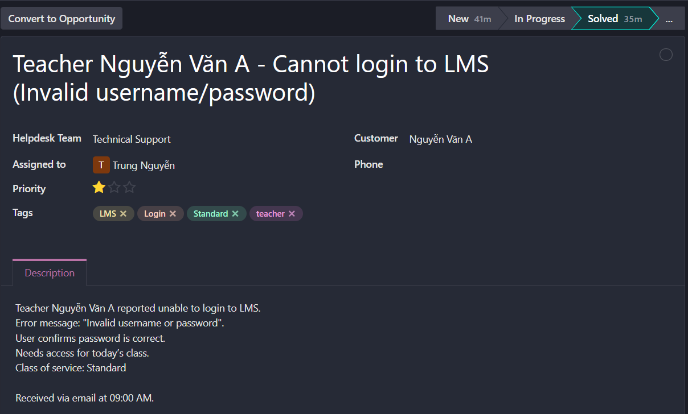
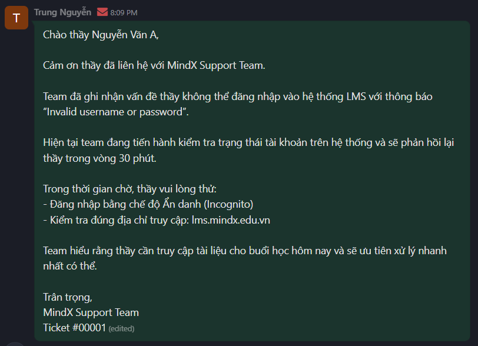
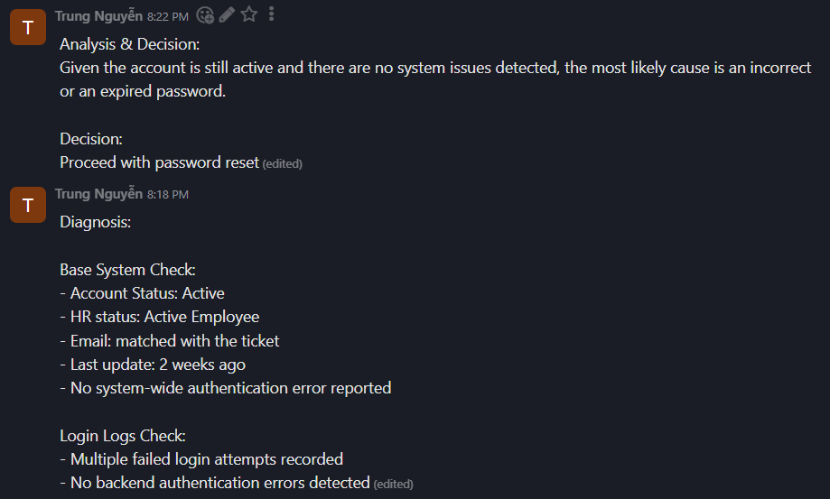
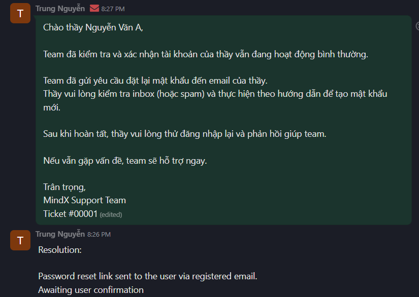

# Scenario 01 – LMS Login Issue (Invalid Username/Password)

## 1. Ticket Information

- Ticket ID: #00001
- Customer: Nguyễn Văn A (Teacher)
- Helpdesk Team: Technical Support
- Assigned To: Trung Nguyễn
- Class of Service: Standard
- Priority: Low (Single user affected)
- Channel: Email
- Tags: LMS, Login, Standard

---

## 2. Problem Description

Teacher Nguyễn Văn A reported being unable to log in to the LMS system.
Error message displayed: **"Invalid username or password"**.

Business Impact:
The teacher required access to LMS materials for a scheduled class on the same day.

---

## 3. Diagnosis

### Base System Check:
- Account Status: Active
- HR Status: Active Employee
- Email: Matched with ticket
- No system-wide authentication errors detected

### Login Logs:
- Multiple failed login attempts recorded
- No backend authentication errors detected

---

## 4. Analysis & Decision

Given that:
- The account was active
- HR status was valid
- No system-wide issue was detected

Most likely cause: **Expired or incorrect password**

Decision: Proceed with password reset.

---

## 5. Resolution

- Password reset link sent to registered email.
- User instructed to reset password and retry login.

Customer confirmed successful login after password reset.

Root Cause: Expired password.

---

## 6. Follow-up & Closure

Customer confirmed successful login.

Ticket status updated to **Solved**.

---

## 7. Trend Analysis

Password-related login issues appear to be common support requests.

Recommendation:
- Add password reset guide on LMS login page
- Implement automated password expiry reminder emails

---

## 8. Screenshots

### Ticket Header

### Initial Acknowledgement Email

### Diagnosis & Analysis Log

### Resolution 

### Closure

## Odoo Ticket Link

[View Ticket #00001 on Odoo](https://mindx4.odoo.com/mail/view?model=helpdesk.ticket&res_id=1&access_token=1f655637-fbc7-4da0-8216-31d8a7bf78d9)
