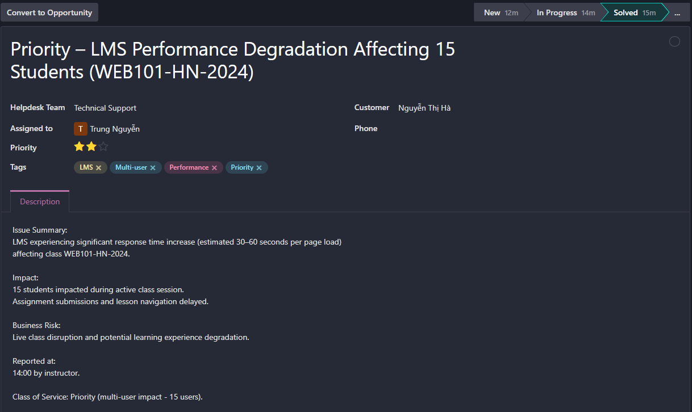
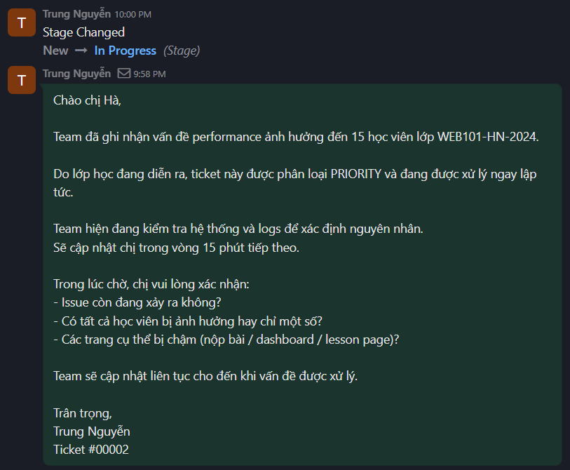
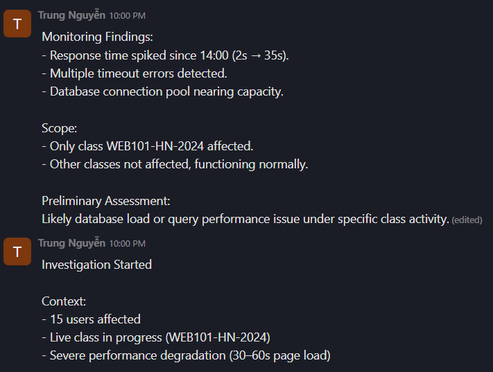
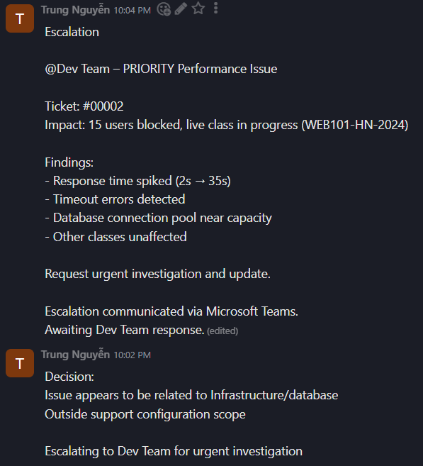
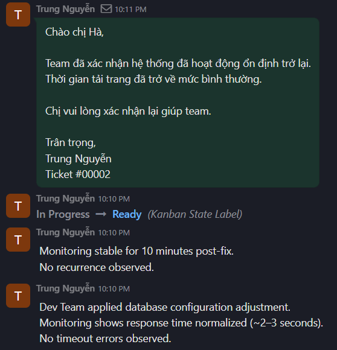
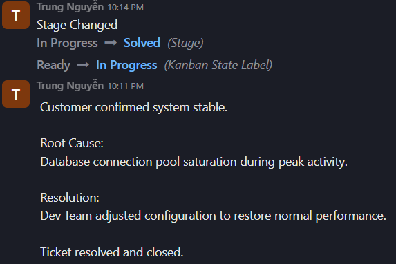

# Scenario 02 – Priority Performance Issue (Multi-User Impact)

## 1. Ticket Information

- Ticket ID: #00002  
- Title: Priority – LMS Performance Degradation Affecting 15 Students (WEB101-HN-2024)  
- Helpdesk Team: Technical Support  
- Assigned to: Trung Nguyễn  
- Class of Service: Priority  
- Priority Level: High  
- Channel: Email, Microsoft Teams
- Tags: LMS, Performance, Multi-user, Priority  

---

## 2. Problem Description

The instructor of class WEB101-HN-2024 reported severe LMS performance degradation during a live session.

Approximately 15 students experienced page load times of 30–60 seconds.

The issue disrupted assignment submissions and lesson navigation.

Reported at 14:00 during an active class.

---

## 3. Business Impact

- 15 users affected simultaneously  
- Live class disruption  
- Risk of learning experience degradation  
- Time-sensitive due to ongoing session  

This ticket was classified as **Priority** due to multi-user impact during live teaching hours.

---

## 4. Initial Response

An acknowledgement email was sent within 15 minutes confirming:

- Issue receipt  
- Priority classification  
- Immediate investigation  
- Commitment to provide updates every 15 minutes  

---

## 5. Investigation & Findings

Internal monitoring and log review (simulation):

- Response time spike from ~2 seconds to ~35 seconds  
- Multiple timeout errors detected  
- Database connection pool nearing capacity  
- Other classes unaffected  

Preliminary Assessment:

Likely database performance issue under peak load specific to WEB101-HN-2024.

---

## 6. Escalation

Since the issue involved infrastructure/database performance outside support configuration scope, it was escalated to the Dev Team.

Escalation included:

- Impact scope (15 users, live class)  
- Monitoring findings  
- Urgency level  

Escalation communicated via Microsoft Teamsz.

Support remained communication owner throughout the incident.

---

## 7. Resolution

Dev Team applied database configuration adjustments.

Post-fix verification:

- Response time normalized (~2–3 seconds)  
- No timeout errors observed  
- Monitoring stable for 10 minutes  

Customer confirmed system stability.

Ticket marked as **Solved**.

---

## 8. Root Cause

Database connection pool saturation during peak load caused system performance degradation for the affected class.

---

## 9. Preventive Recommendation

- Monitor database connection utilization during peak hours  
- Consider connection pool scaling policies  
- Implement alerting thresholds for response time spikes  

---

## 10. Screenshots

### Ticket Header

### Initial Acknowledgement Email

### Investigation & Monitoring Log

### Escalation Note

### User Update

### Resolution & Verification

### Closure

## Odoo Reference

Ticket ID: #00002  
(Odoo training environment link submitted as required.)
