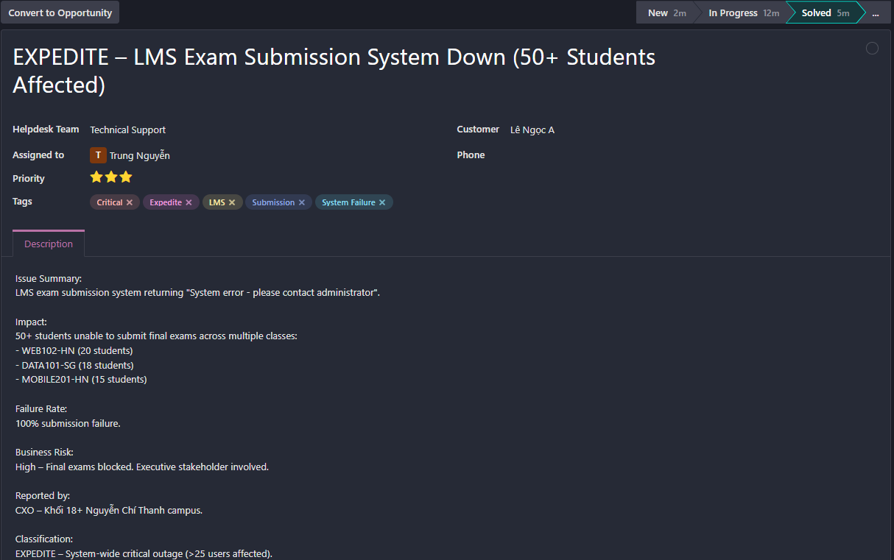
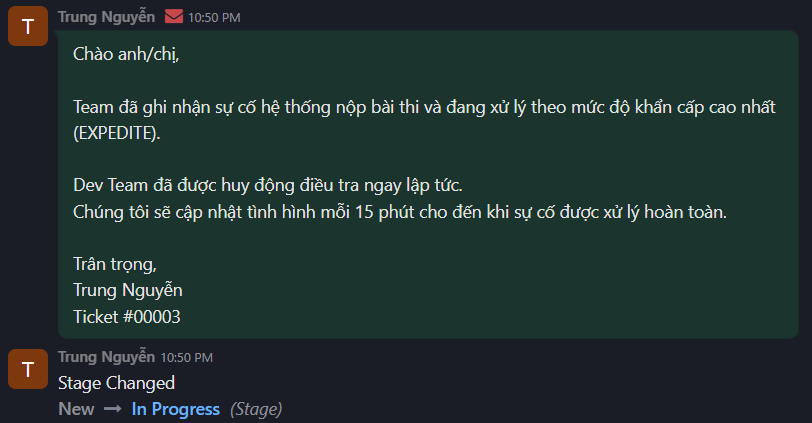
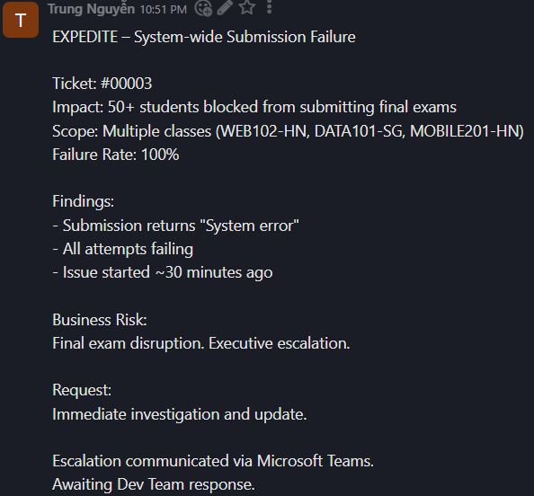
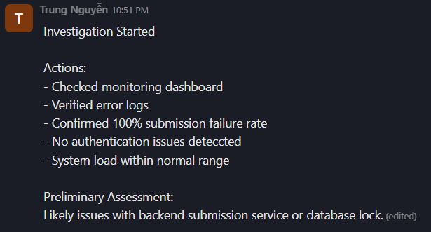
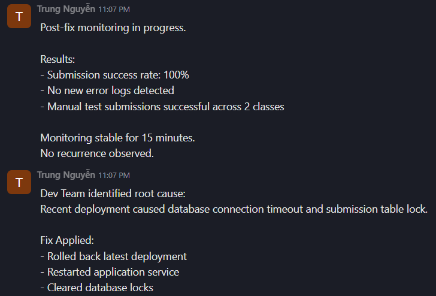
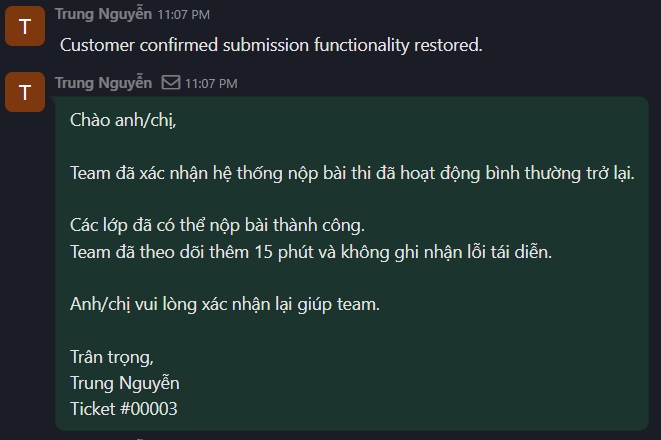
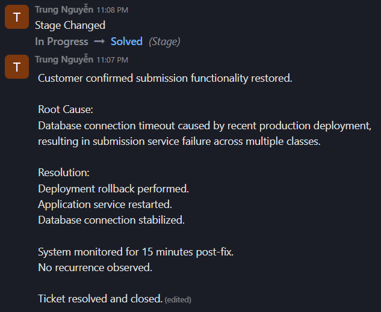

# Scenario 03 – Critical LMS Exam Submission Failure (EXPEDITE)

---

## 1. Ticket Information

- Ticket ID: #00003  
- Customer: CXO – Khối 18+ Nguyễn Chí Thanh Campus  
- Helpdesk Team: Technical Support  
- Assigned To: Trung Nguyễn  
- Class of Service: Expedite  
- Priority: Urgent (System-wide impact)  
- Channel: Email, Microsoft Teams  
- Tags: Critical, Expedite, LMS, Submission, System Failure

---

## 2. Problem Description

A critical system error was reported during final exam sessions.

Error message displayed:  
**"System error – please contact administrator"**

The issue prevented students from submitting their final exams.

### Impact Scope:

- WEB102-HN – 20 students  
- DATA101-SG – 18 students  
- MOBILE201-HN – 15 students  

Total affected users: **50+ students**

Failure rate: **100% submission failure**

### Business Impact:

- Final exams blocked
- Multi-class disruption
- Executive-level stakeholder involved
- High reputational and operational risk

Classification:  
**EXPEDITE – Critical production incident affecting more than 25 users**

---

## 3. Initial Response

Ticket immediately classified as **Expedite**.

Actions taken:

- Stage changed from **New → In Progress**
- Executive acknowledgement email sent
- Dev Team escalation initiated
- 15-minute update commitment communicated

---

## 4. Investigation

### System Checks Performed:

- Monitoring dashboard review
- Application error logs review
- Submission endpoint validation
- Impact scope verification
- Load and infrastructure check

### Findings:

- Submission requests returning system error
- 100% failure rate confirmed
- Database connection pool showing timeout behavior
- No authentication or user-specific errors
- Issue isolated to submission service

### Preliminary Assessment:

Likely backend submission service failure caused by recent deployment or database connection issue.

---

## 5. Escalation

Structured escalation sent to Dev Team including:

- Impact scope (50+ students)
- Multi-class disruption
- 100% failure rate
- Executive involvement
- Business risk classification

Escalation communicated via Microsoft Teams.

---

## 6. Root Cause

Dev Team identified:

A recent production deployment caused **database connection timeout and table lock**, leading to submission service failure.

The issue resulted in complete blockage of exam submissions across affected classes.

---

## 7. Resolution

Corrective actions implemented:

- Rolled back latest deployment
- Restarted application service
- Cleared database connection locks
- Stabilized database configuration

Post-fix testing confirmed successful submissions.

---

## 8. Monitoring

System monitored for 15 minutes post-fix.

Results:

- Submission success rate: 100%
- No new timeout errors detected
- Manual test submissions successful
- No recurrence observed

System performance returned to normal.

---

## 9. Customer Confirmation & Closure

Customer confirmed submission functionality restored.

**Root Cause:**  
Database connection timeout caused by recent deployment change, resulting in submission service failure.

**Resolution:**  
Deployment rollback performed.  
Application service restarted.  
Database connection stabilized.

System monitored post-fix with no recurrence.

Ticket status updated to **Solved**.

---

## 10. Incident Management Evaluation

This scenario demonstrates:

- Proper classification of Expedite incident
- Executive communication handling
- Structured escalation to Dev Team
- Clear documentation of root cause
- Post-fix monitoring before closure
- Professional incident lifecycle management

---

## 11. Screenshots

### Ticket Header

### Acknowledgement Email

### Escalation Note

### Investigation Log

### Monitoring Log

### Customer Update and Confirmation

### Resolution, Root Cause & Closure

## Odoo Ticket Link

[View Ticket #00003 on Odoo](PASTE_YOUR_REAL_LINK_HERE)
