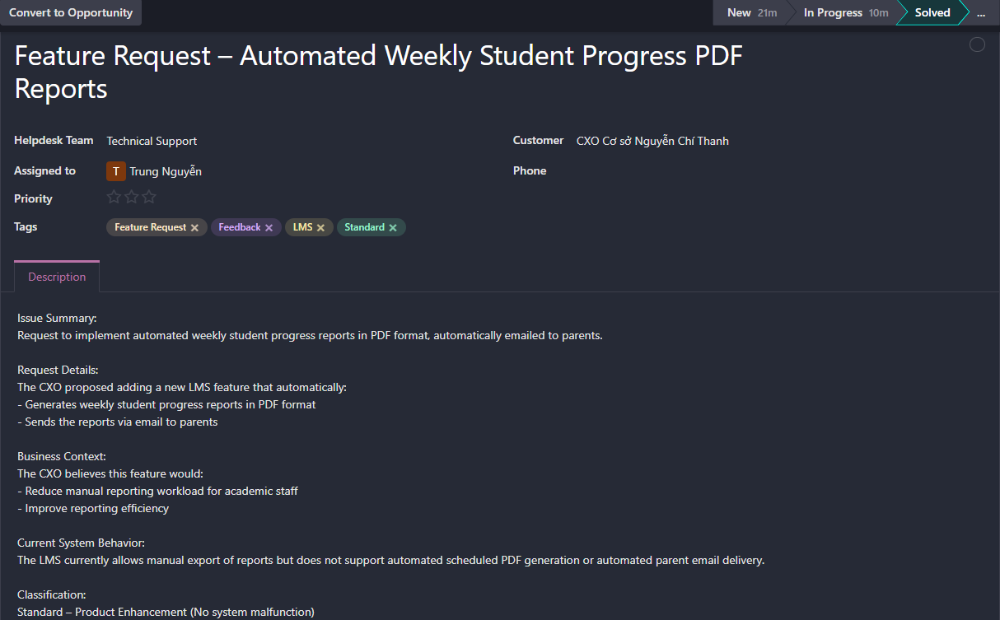
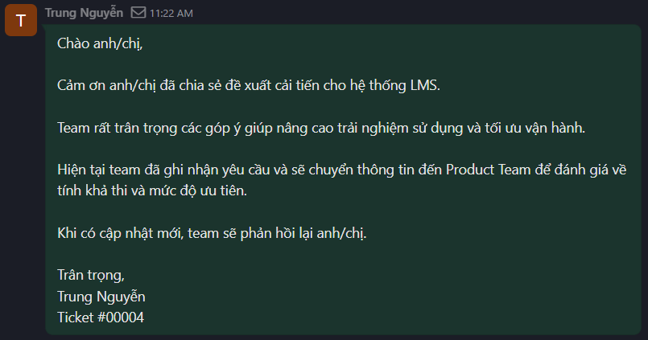
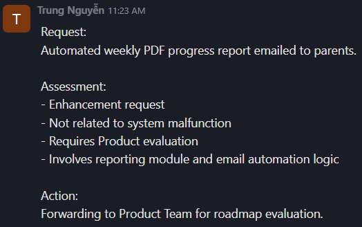
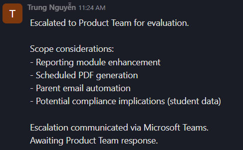
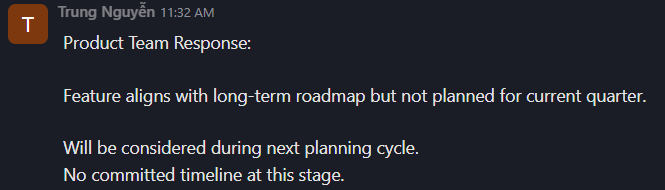
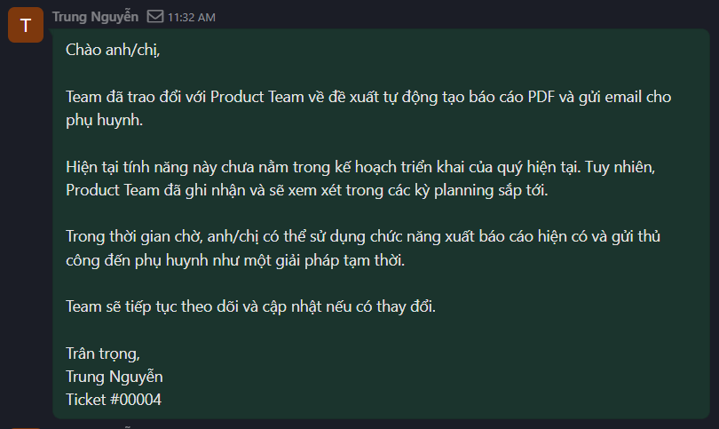
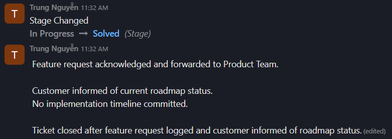

# Scenario 04 – LMS Feature Request (Automated Weekly Progress Reports)

---

## 1. Ticket Information

- Ticket ID: #00004  
- Customer: CXO – Nguyễn Chí Thanh Campus  
- Helpdesk Team: Technical Support  
- Assigned To: Trung Nguyễn  
- Class of Service: Standard  
- Priority: Low (No system impact)  
- Channel: Email, Microsoft Teams  
- Tags: LMS, Feedback, Feature Request, Standard

---

## 2. Problem Description

A feature enhancement request was submitted by the CXO after six months of using the LMS system.

### Request Summary:

Add a feature that automatically:

- Generates weekly student progress reports in PDF format  
- Sends the reports via email to parents  

### Business Context:

The CXO indicated that this functionality would:

- Reduce manual workload for the academic team  
- Improve reporting efficiency  
- Enhance transparency with parents  

### Current System Behavior:

The LMS currently allows manual export of student reports.  
However, it does not support:

- Automated weekly PDF generation  
- Scheduled report automation  
- Automated parent email delivery  

Classification:  
**Standard – Product Enhancement (No system malfunction reported)**

---

## 3. Initial Response

Actions taken:

- Acknowledgement email sent to CXO
- Request documented for internal evaluation
- Escalated to Product Team for feasibility assessment

---

## 4. Internal Assessment

### Evaluation:

- Enhancement request (not a bug or system issue)
- Requires development effort
- Involves reporting module updates
- Requires scheduled automation logic
- Includes automated email workflow
- Potential compliance considerations (student data handling)

Conclusion:

Request falls under Product Team scope and roadmap planning.

---

## 5. Escalation to Product Team

The request was escalated to the Product Team for:

- Feasibility assessment  
- Technical complexity evaluation  
- Roadmap prioritization  
- Resource allocation consideration  

Escalation communicated via Microsoft Teams.

---

## 6. Product Team Response

Product Team feedback:

- Feature aligns with long-term roadmap vision  
- Not planned for the current quarter  
- No committed implementation timeline  

The request will be considered during future planning cycles.

---

## 7. Customer Communication

Customer informed that:

- The request has been reviewed by Product Team  
- It is not currently scheduled for development  
- No implementation timeline is available  
- A manual export workaround is available in the meantime  

Expectation was managed without committing to delivery dates.

---

## 8. Closure

Feature request acknowledged and logged.

Customer informed of roadmap status.  
No timeline committed.

Ticket closed after proper documentation and stakeholder communication.

Ticket status updated to **Solved**.

---

## 9. Screenshots

### Ticket Header

### Initial Acknowledgement Email

### Internal Assessment Log

### Escalation to Product Team

### Product Team Response

### Customer Update

### Closure (Solved Status)

---

## Odoo Ticket Link

[View Ticket #00004 on Odoo](https://mindx4.odoo.com/mail/view?model=helpdesk.ticket&res_id=4&access_token=a00cd002-e338-498e-bf92-13c4c34bc2ae)
