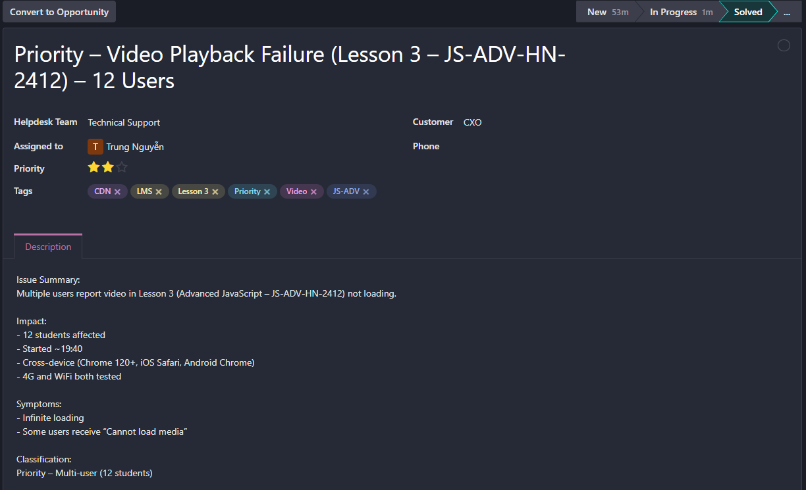
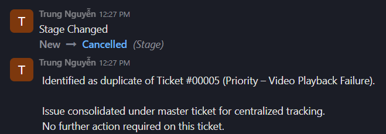
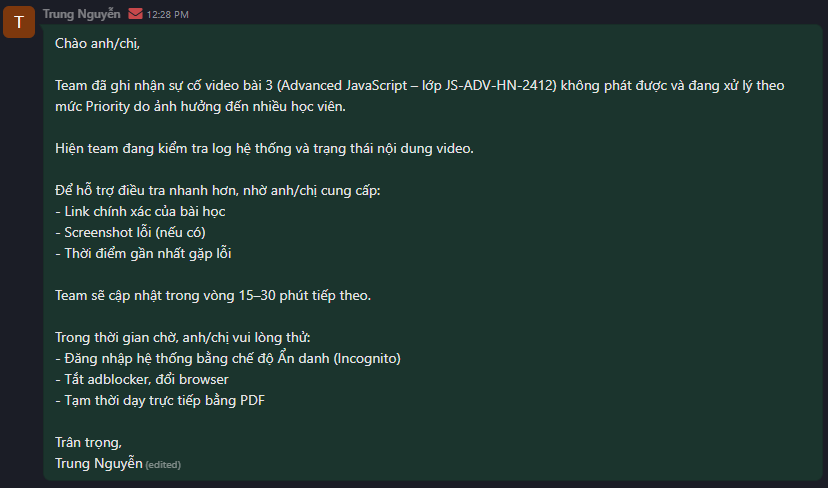
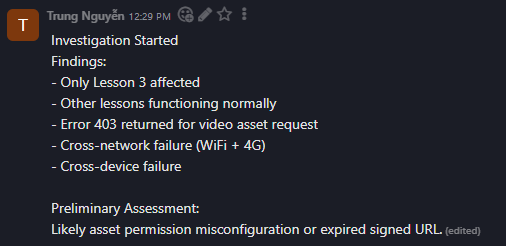
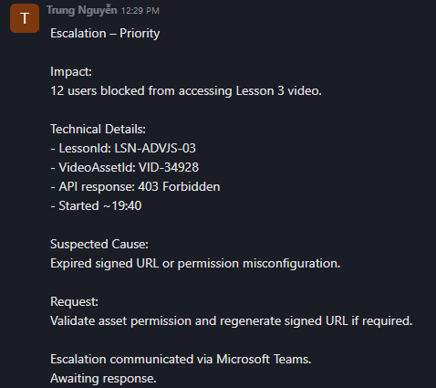
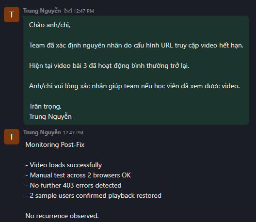
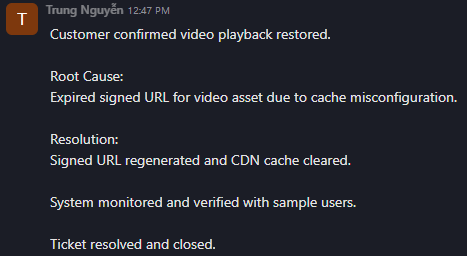

# Scenario 05 – Multi-User Video Playback Issue (Lesson 3 – Advanced JavaScript)

## 1. Ticket Information

- Ticket ID: #00005 (Master Ticket)
- Related Tickets: #00006, #00007 (Marked as Duplicate)
- Customer: CXO – Advanced JavaScript (JS-ADV-HN-2412)
- Helpdesk Team: Technical Support
- Assigned To: Trung Nguyễn
- Class of Service: Priority (5–25 users)
- Priority: High (12 users affected)
- Channel: Email, Microsoft Teams
- Tags: LMS, CDN, JS-ADV, Lesson 3, Video, Priority

---

## 2. Problem Description

Within a 20-minute window, three separate tickets were received reporting that the video in **Lesson 3** of the course **Advanced JavaScript (JS-ADV-HN-2412)** was not playing.

Reported symptoms:

- Video loading indefinitely
- “Cannot load media” error displayed for some users
- Issue persists even after switching networks (WiFi → 4G)
- Affects both desktop (Chrome 120+) and mobile devices (iOS Safari / Android Chrome)

Business Impact:

- 12 students unable to access learning content
- Active class session potentially disrupted
- Immediate Priority classification required

---

## 3. Diagnosis

### Pattern Recognition & Scope Assessment

- Multiple tickets within short timeframe
- Same course and same lesson affected
- Cross-device and cross-network failure
- Other lessons functioning normally

Conclusion:
This is a **multi-user, lesson-specific issue**, not isolated to individual user environments.

---

### Technical Investigation (Simulated Training Check)

Monitoring & Log Review (simulated):

- API response for Lesson 3 video returned **403 Forbidden**
- Other lessons/videos returned normal response (200 OK)
- No system-wide spike in 5xx errors detected
- CDN operational

Preliminary Assessment:
Likely **video asset permission issue or expired signed URL** for Lesson 3.

---

## 4. Analysis & Decision

Given that:

- Only Lesson 3 was affected
- All networks and devices experienced failure
- API returned 403 error
- Other lessons worked normally

Root cause was determined to be content-level configuration, not infrastructure-wide outage.

Decision:

- Consolidate duplicate tickets into one master incident ticket
- Escalate to Dev/Content Operations with asset details
- Monitor post-fix behavior before closure

---

## 5. Resolution

### Escalation Details

Escalated to Dev Team with:

- Lesson ID
- Video Asset ID
- Sample user reports
- API 403 error logs
- Impact scope (12 users)

### Dev Team Action (Simulated)

- Identified expired signed URL due to cache configuration
- Regenerated signed URL
- Cleared CDN cache
- Validated asset permissions

### Verification

- Manual test across 2 browsers successful
- Mobile playback verified
- 2 sample users confirmed video restored
- No further 403 errors observed

Root Cause:
Expired signed URL for Lesson 3 video asset caused by cache misconfiguration.

Resolution:
Signed URL regenerated and CDN cache cleared.

---

## 6. Follow-up & Closure

Customer confirmed video playback functionality restored.

Monitoring conducted for 15 minutes post-fix.
No recurrence observed.

Duplicate tickets (#00006, #00007) were:

- Marked as duplicate
- Linked via internal documentation
- Closed to prevent fragmented tracking

Master ticket updated to **Solved**.

---

## 7. Trend Analysis

This incident highlights the importance of:

- Monitoring signed URL expiry configurations
- CDN cache validation after deployment changes
- Rapid pattern detection for multi-user issues

Recommendation:

- Implement monitoring alert for repeated 403 responses on media assets
- Periodically validate signed URL expiry configuration
- Establish automated alert threshold for media endpoint failures

---

## 8. Screenshots

### Ticket Header (Master Ticket)

### Duplicate Ticket Marked & Closed

### Initial Acknowledgement Email

### Investigation & Log Notes

### Escalation Note

### Dev Response & Root Cause

### Resolution & Monitoring

### Closure (Stage: Solved)

---

## Odoo Ticket Link

[View Master Ticket #00005 on Odoo](https://mindx4.odoo.com/)

