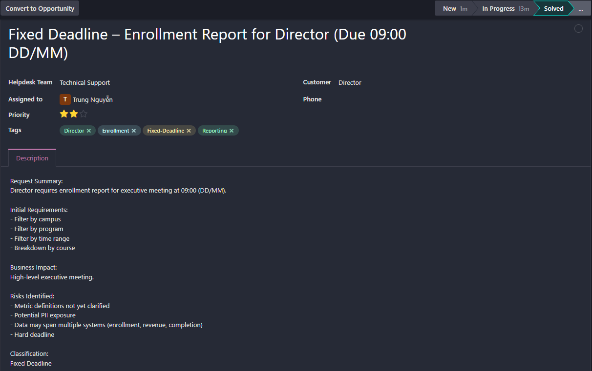
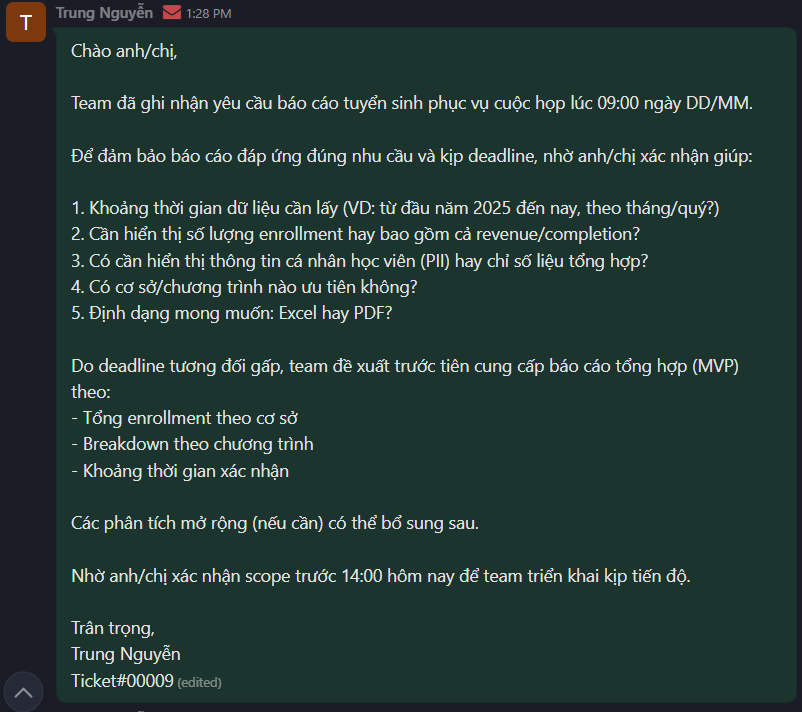
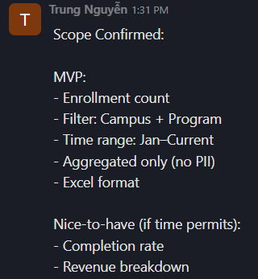
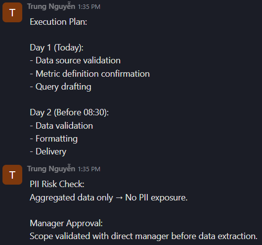
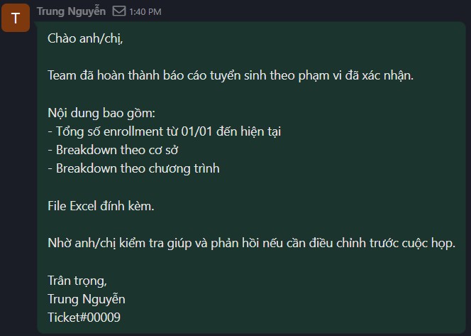
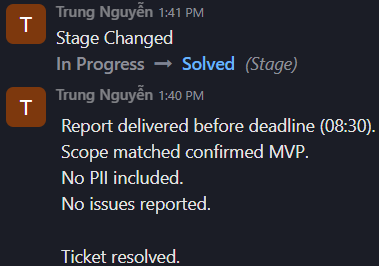

# Scenario 06 – Fixed Deadline Enrollment Report Request

## 1. Ticket Information

- Ticket ID: #00009
- Requestor: Director
- Helpdesk Team: Technical Support
- Assigned To: Trung Nguyễn
- Class of Service: Fixed Deadline
- Priority: High
- Channel: Email
- Tags: Director, Enrollment, Fixed Deadline, Reporting

---

## 2. Problem Description

The Director requested an enrollment report for an executive meeting scheduled at **09:00 (DD/MM)**.

Initial requirements included:
- Filter by campus
- Filter by program
- Filter by time range
- Breakdown by course

### Business Impact:
The report is required for a high-level executive meeting. Failure to deliver before the deadline may impact strategic discussions and decision-making.

---

## 3. Risk & Scope Assessment

### Risks Identified:
- Metric definitions not yet clarified
- Potential PII (Personally Identifiable Information) exposure
- Data may span multiple systems (enrollment, revenue, completion)
- Non-negotiable hard deadline

### Classification Decision:
- Class of Service: **Fixed Deadline**
- Priority: **High**
- Type: **Reporting / Service Request**

Given the executive-level deadline and business impact, immediate scope clarification was required before execution.

---

## 4. Scope Clarification

Clarification email sent to confirm:

- Exact time range required
- Whether revenue/completion data needed
- Whether PII should be included or aggregated only
- Preferred output format (Excel or PDF)

### Confirmed Scope (MVP):

- Enrollment count only
- Time range: 01/01 to current date
- Filters: Campus and Program
- Course-level breakdown
- Aggregated data only (No PII)
- Output format: Excel

Nice-to-have items were deferred to avoid deadline risk.

---

## 5. Execution Plan

**Day 1:**
- Validate data source
- Confirm metric definitions
- Prepare draft query

**Day 2 (Before 08:30):**
- Validate data accuracy
- Format report
- Internal verification
- Deliver before 09:00 deadline

Data governance check performed:
- Aggregated metrics only
- No student-level data included

---

## 6. Resolution

Report completed and delivered at **08:30**, before deadline.

Contents included:
- Total enrollment (01/01 – current)
- Breakdown by campus
- Breakdown by program
- Course-level distribution

File delivered in Excel format as confirmed.

---

## 7. Follow-up & Closure

Director acknowledged receipt of the report.

- Deadline met successfully
- Scope aligned with confirmed requirements
- No PII exposure
- No post-delivery corrections required

Ticket status updated to **Solved**.

---

## 8. Trend Analysis

Executive reporting requests with fixed deadlines require:

- Immediate scope clarification
- MVP-first delivery strategy
- Strict deadline control
- Data governance awareness

Recommendation:
- Develop standardized executive enrollment report template
- Pre-define KPI definitions to reduce clarification time
- Maintain ready-to-export dashboard for leadership

---

## 9. Screenshots

### Ticket Header

### Initial Clarification Email

### Scope Confirmation Log

### Execution Plan Note

### Delivery Email

### Closure

---

## Odoo Ticket Link

[View Master Ticket #00009 on Odoo](https://mindx4.odoo.com/mail/view?model=helpdesk.ticket&res_id=10&access_token=07f394f1-a535-4c00-9284-a842f90c5596)

